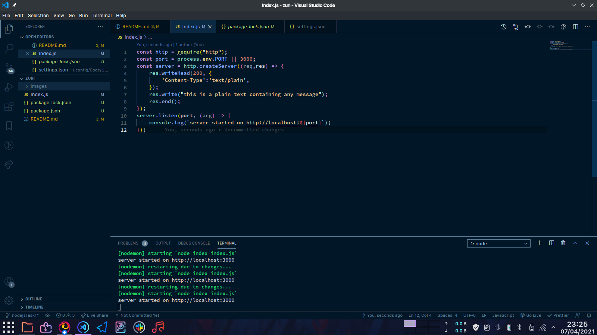
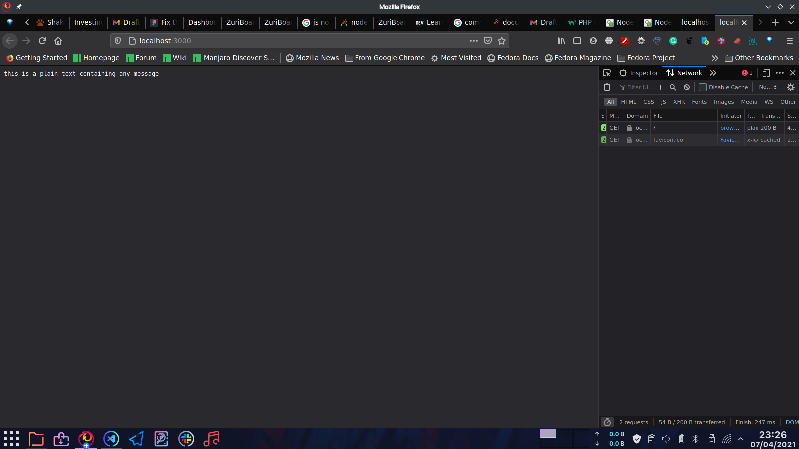

# nodejsTask4

## Questions

* Create a simple Node JS server on whatever port you like. Send the following to the client.

   * A plain text containing any message
   * A Json object of your name, country and hobby
   * A simple web page.

* Upload screenshots of your code and result

## results

* the screenshots will be listed below

## A plain text containing any message

* code 

* result

## A Json object of your name, country and hobby

* code 

* result

## A simple web page.

* code 

* result

